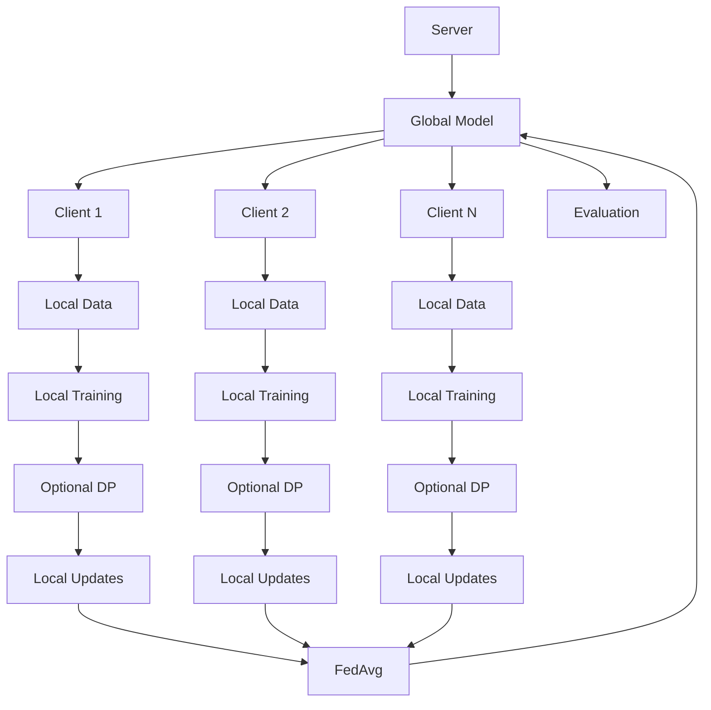

# Fed-DP Demo

A compact PyTorch project that demonstrates Federated Averaging and client-side Differential Privacy on a small MNIST subset. It is intentionally undertrained so the full pipeline stays CPU-friendly and easy to inspect.


## Important: undertrained demo

This is **not** a working privacy–utility result. With the default setup the model barely learns:

- Chance-level cross-entropy on 10 MNIST classes is about `ln(10) ≈ 2.30`
- FedAvg test loss is about `2.26` with accuracy about `14.7%`
- DP variants stay near chance (~12% accuracy, loss ~2.30)

Treat the numbers as smoke-test outputs from a short demo run, not as evidence that DP-SGD preserved useful accuracy.

## What it does

Simulates several local clients on partitioned MNIST, trains each client with SGD or Opacus DP-SGD, aggregates with FedAvg, and evaluates a global model. Results are written to `experiments/results.csv`.

## Default experiment setup

Values used for the saved CSV (and the defaults in code):

| Parameter | Value |
|---|---|
| Clients | 5 |
| Rounds | 5 |
| Local epochs | 1 |
| Seed | 42 |
| Train / test subset | 1500 / 300 MNIST samples |
| Batch size | 64 |
| Learning rate | 0.01 |
| Model | `SmallMNISTCNN` |

## Measured results (`experiments/results.csv`)

| Configuration | Epsilon | Delta | Noise | Accuracy | Test loss |
|---|---:|---:|---:|---:|---:|
| FedAvg | N/A | 1e-5 | 0 | 14.666667% | 2.26403 |
| DP-Strong | 10.979823 | 1e-5 | 1.5 | 12.333333% | 2.299045 |
| DP-Medium | 22.086591 | 1e-5 | 1.0 | 12.333333% | 2.298986 |
| DP-Weak | 77.268854 | 1e-5 | 0.5 | 12.0% | 2.298948 |

## How reported epsilon is computed

This is **not** a single Opacus accountant over the aggregated global model, and it is **not** presented here as a formal composed privacy guarantee for the released model.

What the code actually does:

1. Each federated round uses `delta_round = delta / rounds` when building the client `DPConfig`.
2. Each client trains with its own Opacus privacy engine and reports that client's epsilon for the round.
3. The round contribution is `max(client epsilons)` for that round.
4. The CSV epsilon is the **sum** of those per-round maxima across all rounds.

So the number is a simple sum-of-round-maxima diagnostic derived from per-client Opacus calls, not a production privacy certificate.

## Architecture



## Project structure

```text
fed-dp-demo/
├── README.md
├── requirements.txt
├── .gitignore
├── LICENSE
├── src/
│   ├── data.py
│   ├── model.py
│   ├── client.py
│   ├── fedavg.py
│   ├── dp.py
│   ├── server.py
│   ├── evaluation.py
│   └── main.py
├── experiments/
│   ├── run_experiment.py
│   └── results.csv
├── scripts/
│   └── smoke_test.py
├── tests/
│   ├── test_fedavg.py
│   └── test_data_partition.py
├── diagrams/
│   └── architecture.mmd
└── data/
    └── .gitkeep
```

## Installation

Python 3.10+. CPU is enough.

### Windows

```powershell
python -m venv .venv
.\.venv\Scripts\Activate.ps1
python -m pip install --upgrade pip
python -m pip install -r requirements.txt
```

### macOS / Linux

```bash
python3 -m venv .venv
source .venv/bin/activate
python -m pip install --upgrade pip
python -m pip install -r requirements.txt
```

## How to run

```bash
python scripts/smoke_test.py
python -m src.main --mode fedavg
python -m src.main --mode experiment
```

Custom knobs:

```bash
python -m src.main \
  --mode experiment \
  --clients 5 \
  --rounds 2 \
  --local-epochs 1 \
  --batch-size 64 \
  --learning-rate 0.01 \
  --seed 42 \
  --noise-multiplier 1.0 \
  --max-grad-norm 1.0
```

Overwrite the CSV if you intentionally re-run:

```bash
python -m src.main --mode experiment --overwrite
```

## Walkthrough

1. Explain the architecture: local client data, local training, FedAvg aggregation.
2. Run the smoke test: `python scripts/smoke_test.py`.
3. Inspect modules: data partitioning, client training, FedAvg, evaluation, DP hooks.
4. Run baseline FedAvg: `python -m src.main --mode fedavg`.
5. Run the DP comparison: `python -m src.main --mode experiment`.
6. Compare rows in `experiments/results.csv`, remembering the model is undertrained.
7. Explain the reported epsilon formula above and the project limitations.

## Limitations

- Simulated clients only; no real device fleet
- Tiny MNIST subset and few rounds/epochs (undertrained by design)
- IID-style partitioning; no non-IID stress case in the saved CSV
- No secure aggregation or malicious-client defenses
- Reported epsilon is the sum-of-round-maxima diagnostic described above, not a formal end-to-end guarantee
- Opacus secure RNG is disabled for faster CPU demos; do not treat that as production-ready

## Troubleshooting

**Torch import errors:** use the project `.venv` and reinstall from `requirements.txt`.

**MNIST download:** TorchVision downloads into `data/MNIST` (gitignored). Needs write access under the project root.

**Opacus notices:** expected in this demo setup; enable secure mode before any real privacy deployment.

## License

MIT. Copyright (c) 2026 Suleman Qamar.
